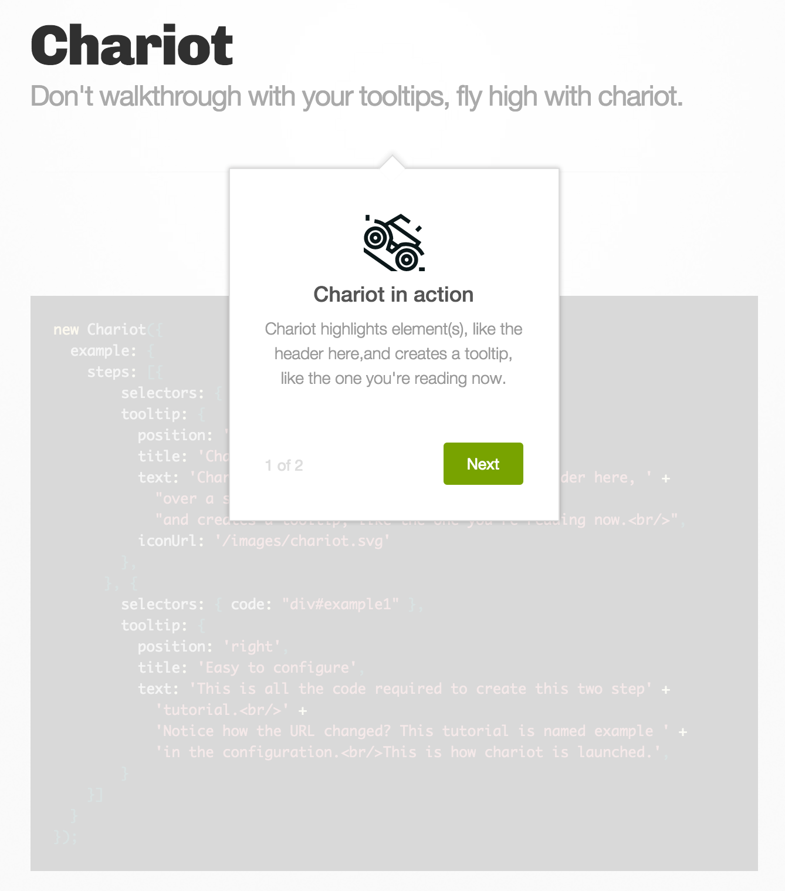

# Chariot
> Walkthroughs so easy, you might as well be flying in a chariot.

A Javascript library for creating step-by-step tooltip tutorials, using a
background overlay to bring focus to the elements you care about.

# Demo

Visit the [live demo](http://chariot.zendesk.com).

# Motivation
Tooltips are better at drawing focus to highlighted elements on a website
when the background is dimmed out.

Existing tooltip overlay solutions don't use overlay backgrounds, or if they
do, they fail to consider when parent containers already have the CSS
`z-index` property set.
(A child element's `z-index` cannot override it's parent's `z-index`).

# Features

- Programmatic API and lifecycle callbacks
- Overlay obscures the background, and your key elements are cloned over it
- `z-index` is taken care of
- Tooltips are animated into view
- Browser support includes every sane browser and IE9+

# Usage

`chariot.js` works in global, CommonJS and AMD contexts.

Visit the [demo page](http://chariot.zendesk.com) for usage examples.

# API

If you're running the project locally, you can view the JSDoc-formatted
documentation at
[http://localhost:8080/docs/global.html](http://localhost:8080/docs/global.html).

Or go to the example site: http://chariot.zendesk.com/docs

# Development

Install node packages.

	yarn install # if you use yarn, otherwise
	npm install

Install the gulp cli.

	npm install -g gulp

To run a webserver:

	gulp connect

This will start a simple server. A bare page `index.html` can be seen at
[http://localhost:8080/example/index.html](http://localhost:8080/example/index.html),
 and loads `chariot.js` onto the page.
The task will also watch your changes and reloads the page as the files are updated.

Run the following style-checker before pushing your branch.

	gulp style

To automatically fix the style errors:

	gulp style-fix

To update the generated docs:

	gulp js-doc

# Testing

## Command Line
To run test in command line, run:

	gulp test

or to run a single test file:

	npm run test test/filename.js

## Browser
If you want to test the same test suite in multiple browsers, run:

	gulp testem

The browsers to test can be configured in `testem.yml`, currently it is configured to test in all major browsers (Firefox, Safari, Chrome) and PhantomJS.

# Build
Run the following to build `chariot.js` into thd `/dist` directory.

	gulp

*Do not check in the `dist` directory. Release on github will contain the tarballs with compiled js/css.*

# Release

When you have merged in your changes from your branch (via Github pull requests). Run the following `master`:

	gulp release

This gulp task will

1. Bump version in package.json
1. Auto-generate documentation with js-doc
1. Package release into the `release/` folder
1. Commit the version bump changes in package.json
1. Push the bump changes
1. Tag with the new version

After releasing, update the relevant files in your project which uses ChariotJS.
Update the version in your project's package.json, or
copy the release/chariot.[min.]js, release/chariot.[min.]css files into your
project's `vendor/` folder.

# Copyright and License

Copyright 2016, Zendesk Inc. Licensed under the Apache License Version 2.0, http://www.apache.org/licenses/LICENSE-2.0

